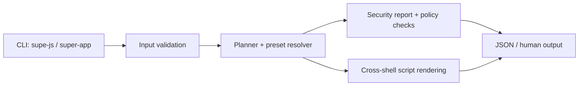

# Supe Js ⚡ (formerly Super App)

<p align="center">
  <a href="#quick-start"></a>
  <a href="./LICENSE"></a>
  <a href="#included-capabilities"></a>
  <a href="#policy-as-code"></a>
</p>

<p align="center">
  
</p>

Supe Js is an open-source **Node.js toolkit** with one CLI for:
1. Goal/task planning with local JSON persistence.
2. Dev-friendly starter scaffolding for modern frameworks.
3. Security policy checks to catch risky scaffold combinations.
4. Reusable preset packs with CI templates and ranking.
5. Cross-platform script output (`bash`, `powershell`, `cmd`) and environment diagnostics.
6. Policy-as-code checks (`policy-check`) for org-level governance.

> Backward compatibility: the original command name `super-app` is still supported.

---

## Included capabilities

- Goal planning + completion tracking
- Save/load local state to JSON
- Framework support:
  - React, Vue, Svelte, Solid, Angular, Next.js
  - Nuxt, Remix, Astro, Qwik, Gatsby, Fresh (Deno)
- UI libraries:
  - Tailwind, MUI, Ant Design, Chakra UI, Bootstrap
  - Mantine, shadcn/ui, Radix UI, daisyUI, Fluent UI, Primer, PrimeVue
- Package managers:
  - npm, pnpm, yarn, bun, deno
- Security + safety:
  - project-name validation (including Windows reserved names)
  - execution allowlist + timeout guardrails
  - compatibility-aware framework/package-manager checks
- Preset workflows:
  - built-in starter presets
  - external presets (`--from`) with SHA-256 verification (`--from-sha256`)
  - optional ranking (`--rank`, `--telemetry-score`)
- Team workflows:
  - `doctor`, `profile`, `sync`, and `reminder`

---

## Quick start

```bash
npm test
node bin/supe-js.js --help
node bin/supe-js.js doctor --json
node bin/supe-js.js starter my-app --framework react --package-manager pnpm --ui tailwind --json
node bin/supe-js.js policy-check --file ./policy.json --framework react --package-manager pnpm --ui tailwind --json
```

### Command highlights

- `supe-js doctor [--refresh] [--json]` — environment diagnostics.
- `supe-js starter ... --shell <bash|powershell|cmd>` — shell-specific script output.
- `supe-js preset --list [--from <file>] [--from-sha256 <hex>] [--rank]` — discover presets.
- `supe-js preset --name <preset> <project> [--with-docs-site]` — scaffold from preset.
- `supe-js policy-check --file <policy.json>` — evaluate config against policy rules.
- `supe-js sync --user <id>` — team sync plan for GitHub/GitLab/Bitbucket.

> Legacy command name continues to work:
>
> `super-app <command> ...`

---

## Policy as code

Example `policy.json`:

```json
{
  "version": "2025.1",
  "blockedFrameworks": ["next"],
  "blockedUi": ["primer"],
  "allowedPackageManagers": ["pnpm", "yarn"]
}
```

Run check:

```bash
node bin/supe-js.js policy-check --file ./policy.json --framework react --package-manager pnpm --ui tailwind --json
```

- Exit code `0` = policy pass
- Exit code `2` = policy fail

---

## CLI architecture (high level)



---

## GitHub customization ideas

- Add repository topics: `nodejs`, `cli`, `scaffolding`, `security`, `devtools`, `cross-platform`.
- Pin a short “Getting Started” issue + discussion thread.
- Enable branch protection + required checks (`npm test`, CLI smoke).
- Enable Dependabot + secret scanning + code scanning.

---

## Open source project files

- [LICENSE](LICENSE)
- [CONTRIBUTING.md](CONTRIBUTING.md)
- [CODE_OF_CONDUCT.md](CODE_OF_CONDUCT.md)
- [SECURITY.md](SECURITY.md)

## Project goals

See [GOALS.md](GOALS.md) for roadmap phases.
